# Administrator Dashboard

A work-in-progress project for my portfolio designed exclusively with frontend technologies using a dummy API and some generated mock data.

# Overview

<!--TODO: FIX THE LINKS!!!-->

- [Requests and Features](#Requests-and-features)

  - [Requests](#requests)
  - [Features](#features)
  - [Other functionalities](#Other-functionalities)

- [Pages](#pages)

  - [Login page](#login-page)
  - [Dashboard page](#dashboard-homepage)
  - [Goods page](#goods-page)
  - [Services page](#services-page)
  - [Analytics page](#analytics-page)
  - [Sales Channels page](#sales-channels-page)
  - [Customers page](#customers-page)
  - [Orders page](#Orders-page)
  - [Compare page](#Compare-page)
  - [Dynamic Good page](#dynamic-good-page)
  - [Dynamic Service page](#dynamic-service-page)
  - [Dynamic Salesperson page](#dynamic-salesperson-page)
  - [Dynamic Sales Channel page](#dynamic-sales-channel-page)
  - [Dynamic Customer page](#dynamic-customer-page)
  - [Dynamic Order page](#dynamic-order-page)
  - [Error page](#error-page)
  - [Aditional features](#aditional-features)

- [Technologies](#technologies)
  - [Logic](#logic)
  - [Styling](#styling)
  - [Animation](#animations)
  - [Other](#other)
- [Design](#Design-inspirations)
  - [Desktop](#desktop)
    - [Main pages](#main-pages-1)
    - [Loading page](#login-page-1)
    - [Error page](#error-page)
  - [Tablet](#tablet)
    - [Main pages](#main-pages-2)
    - [Loading page](#login-page-2)
    - [Error page](#error-page-1)
  - [Mobile](#mobile)
    - [Main pages](#main-pages-3)
    - [Loading page](#login-page-3)
    - [Error page](#error-page-2)

# Requests and features

## Requests:

- **Today's** sales, also a _comparison_ between today's sales and the sales on the same day last year, and the year before
- **This week's** sales, with the same _comparison_
- **This month's** sales, with the same _comparison_
- **This year's** sales, with _comparison_ from the beginning of the year until the same day of the year - for the past 2 years

**Structure of the sales**:

1.  Total _goods_, with a list of goods, sorted in decending order
2.  Total _services_, with a list of services, sorted in decending order
3.  Total _profits_ from goods, profit margin - with analytics: for this week, this month and this year - compared to the past 2 years
4.  _Analytics of the sales by salespeople_: total sales, total profits and profit margins
5.  _Structure of the sales by sales channels_: webshop, invoices, customer visits

## Features:

The ability to view:

1. Total goods, with a list of goods, sorted in decending order
2. Total services, with a list of services, sorted in decending order
3. Total profits from goods, profit margin - with analytics: for this week, this month and this year - compared to the past 2 years

## Other functionalities

- If the admin IS NOT logged in - don't allow access to the application
- Toggle switch between light and dark mode
  - Alternatively/Additionaly, themes?
- Optional: Language switch
- ALL of the lists need to take the time filter into account. If displaying something (eg. Orders), DON'T display all of the orders ever created, display only the ones created based on that time filter.
- Implement a currency API that, upon selecting, displays all of the elements with that currency.
- On each of the

# Pages:

## Login page

Upon opening the app this is the first page the user is taken to. There is a username and password input fields which the user must fill. If correct, the dasboard becomes available, if not, a message appears under the input fields signalling that something went wrong.

 

## Dashboard (HomePage)

**Time filter** - The dashboard homepage includes a **select field** in which we can pick an option: "weekly", "monthly", "yearly", "last 2 years", "All time" upon which the Dashboard homepage will display the data with that filter.
Filter explanation:

- Weekly means the past 7 days starting from yesterday.
- Monthly means the past 30 days starting from yesterday.
- Yearly means the past 365 days starting from yesterday.
- Last 2 years means the past 2 years starting from yesterday.
- All time means from the creation of the first order by a customer to yesterday.

Based on that filter:

- The **cards** will display data for the _current_ week/month/year/last 2 years/all time and _comparrison_ (percentage indicator) for the same time filter but for the date 1 increment before that (eg. If the filter is on "week" (last 7 days), the comparison will be for the 7 days before that).
- The **charts** will display the data for the _current_ week/month/year/last 2 years (there is no comparrison to previous time filters like with the cards).
- The **lists** will also display the data from the _current_ week/month/year/last 2 years.

The data will be displayed with these components:

1. **Sales revenue card** - displays total revenue.
2. **Sales profit card** - displays sales profit (revenue - expenses).
3. **New customers card** - displays the number of new customers (based on data from the past week, month, year, 2 years, all time according to the filter). <!--Hashmap?-->
4. **Average order value card** - displays the average price of the total orders of all customers based on the specified filter.
5. **Repeat purchase rate card** - maybe this can be a precentage statistic displaying how many customers came back to purchase again (if a customer has made at least 2 orders). <!--TODO: think of what to make this component -->
6. **Trending goods list**

- Displays the _goods_ that, based on the time filter, are being sold the most.
- Upon clicking this list, it takes us to the [Goods page](#Goods-page) and sets the filter on that page to "secured in the highest volume".
- Alternatively, clicking on a good takes us to the dynamically generated page for that particullar good [Dynamic good page](#Dynamic-good-page).
- Alternatively, this could also be a **Bar Chart**, or there could be a toggle option from chart-to-list/list-to-chart

7. **Trending services list**

- Displays the _services_ that, based on the filter, are bing sold the most.
<!--TODO: Think of a better name "secured in the highest volume" is too long for a filter-->
- Upon clicking this list it takes us to the [Services page](#Services-page) and sets the filter on that page to "secured in the highest volume".
- Alternatively, clicking on a service takes us to the dynamically generated page for that particullar good [Dynamic services page](#Dynamic-service-page).
- Alternatively, this could also be a **Bar Chart**, or there could be a toggle option from chart-to-list/list-to-chart

8. **Recent orders list** - displays the most recent orders. This card does NOT care about the filter and just displays the last few goods/services that were purchased.

9. **Top customers list** - displays the customers that generated the most revenue weekly/monthly/yearly/from the last 2 years/all time based on the filter.

10. **Goods and services rank list** - displays the goods and services in combination, ranked decendingly starting from the one that generated the most profit.

- Eg text. Most profitable sales
- Alternatively/Additionally this could also be a bar chart.

11. **Most requested good** - the good that was purchased the most.

12. **Most requested service** - the service that was requested the most. If it's a tie, display all of the services in a small list.

13. **Profits bar chart** - displays the profits generated by both the goods and services sorted in a ascending/decending order.

14. **Revenue bar chart** - displays the revenue generated by both the goods and services sorted in a ascending/decending order.

15. **Expenses bar chart** - displays the expenses generated by both the goods and services sorted in a ascending/decending order.

<!--TODO: Define a few more charts and what they should be about-->

Must implement features:

- All of the cards must include a small **percentage increase/decrease indicator** on the bottom right/left to compare the results from the previous week, month, year or the last 2 years (based on the selector).

- The elements in the Dashboard must be **draggable** so that the Admin can customize their app accordingly.

- Best chart practices:
  - Line charts for trends over time
  - Bar charts for comparisons
  - Pie charts for distribution

 

## Goods page

Just as the [Dashboard homepage](#dashboard-homepage) this page will also include the _time filter_.

Elements:

1. A **list** of all _goods_, sorted by filter (A-Z, Z-A, low-to-high price, high-to-low price, date ascending, date decending, secured the highest volume, secured the lowest volume)

- A list item is to include these columns:

  - good id#
  - good name
  - good img/icon
  - good price
  - good category

- Upon clicking one of the list items - go to a [dynamically generated good page](#Dynamic-good-page) for that particular _good_ just the same as in the Trending goods list in [Dashboard homepage](#dashboard-homepage)
- add pagination

Include these elements based on the time filter:

2. A **Line chart** that displays the _revenue_ generated by each of the goods.
3. A **Line chart** that displays the _profit_ generated by each of the goods.
4. A **Line chart** that displays how much each good _costs_ to produce/buy from the manufacturer.

These next elements are ought to include a small _percentage indicator %_ that compares the data to itself based on the time filter (eg. If "past 7 days" is selected, the percentage indicator shows the comparred data between the past 7 days and the 7 days before them starting from yesterday):

5. A **Revenue card** that displays the _total revenue_ generated numerically.
6. A **Profit card** that displays the _total profit_ generated numerically.
7. A **Costs card** that display the _total cost_ generated numerically.

Another functionality - A comparrison sub-page that implements the time filter. There are two selections for 2 different goods split down the middle of the window. Upon selecting an option in the time filter and selecting the desired goods, a comparison will be displayed made by :

- Generated revenue
- Generated profit
- Accumulated Costs
- Other relative comparrisons

 

## Services page

Just as the [Dashboard homepage](#dashboard-homepage) this page will also include the _time filter_.

1. A **list** of all _services_, sorted by filter (A-Z, Z-A, low-to-high price, high-to-low price, date ascending, date decending, secured the highest volume, secured the lowest volume). Unaffected by the time filter - display ALL services.

- Upon clicking one of the list items - go to a [dynamically generated good page](#Dynamic-services-page) for that particular _service_ just the same as in the Trending services list in [Dashboard homepage](#dashboard-homepage)
- add pagination

The services page is to include these elements based on the time filter:

2. A **Line chart** that displays the revenue generated by each of the services.
3. A **Line chart** that displays the demand of the services.
4. A **Line chart** that displays how much each service costs to implement (how much the employees are paid to produce that service).

These next elements are ought to include a small _percentage indicator %_ that compares the data to itself based on the time filter (eg. If "past 7 days" is selected, the percentage indicator shows the comparred data between the past 7 days and the 7 days before them starting from yesterday):

5. A **Revenue card** that displays the _total revenue_ generated numerically.
6. A **Profit card** that displays the _total profit_ generated numerically.
7. A **Costs card** that display the _total cost_ generated numerically.

Another functionality - A comparrison sub-page that implements the time filter. There are two selections for 2 different services split down the middle of the window. Upon selecting an option in the time filter and selecting the desired goods, a comparison will be displayed made by :

- Generated revenue
- Generated profit
- Accumulated Costs
- Other relative comparrisons

 

## Analytics page

The analytics page is to analyze the performance of employees - "the sales of the salespeople". Just as the [Dashboard homepage](#dashboard-homepage) this page will also include the time filter.

Elements:

1. A **list** with all the employees at the company sorted by a filter (A-Z, Z-A, date of employment decending, date of employment ascending, secured the highest volume, secured the lowest volume)

- Upon clicking one of the list items - go to a [dynamically generated salesperson page](#Dynamic-salesperson-page) for that particular _salesperson_ just the same as in the Trending goods list in [Dashboard homepage](#dashboard-homepage)
- add pagination

The analytics page is to include these elements based on the _time filter_:

2. A **Line chart** that displays the _revenue_ generated by each employee.
3. A **Line chart** that displays the _profit_ generated by each employee.
4. A **Bar chart** that displays the total _number of services done_ by each employee.
5. A **Bar chart** that displats the total _number of goods sold_ by each employee.

These next elements are ought to include a small _percentage indicator %_ that compares the data to itself based on the time filter (eg. If "past 7 days" is selected, the percentage indicator shows the comparred data between the past 7 days and the 7 days before them starting from yesterday):

5. A **Revenue card** that displays the _total revenue_ generated numerically.
6. A **Profit card** that displays the _total profit_ generated numerically.
7. A **Costs card** that display the _total cost_ generated numerically.
   - Think of what to make of this - how much is the employee getting paid monthly maybe?🤔

<!-- Another functionality - A comparrison sub-page that implements the time filter. There are two selections for 2 different salespeople split down the middle of the window. Upon selecting an option in the time filter and selecting the desired salespeople, a comparison will be displayed made by :

- Generated revenue
- Generated profit
- Accumulated Costs
- Other relative comparrisons -->

 

## Sales channels page

This page includes a **list** of all the sales channels. Upon clicking one of these physical locations a [dynamic sales channel page](#dynamic-sales-channel-page) is opened in which data for the sales channel is displayed.

Elements:

1. A **list** with all the sales channels at the company sorted by a filter (A-Z, Z-A, secured the highest volume, secured the lowest volume, status (active/inactive))

Each list item is to include these elements:

- A **Revenue column** that displays the _total revenue_ generated numerically.
- A **Profit column** that displays the _total profit_ generated numerically.
- A **Costs column** that displays the _total costs_ (total costs for providing the goods/services) generated numerically.
- A **Status column** that displays if the sales channel _is currently active_ (open/closed).

The elements listed below will filter their items based on the _time filter_.

2. A **Bar chart** that displays the _revenue_ generated by each sales channel.
3. A **Bar chart** that displays the _profit_ generated by each sales channel.
4. A **Bar chart** that displays the total _traffic_ (number of transactions) by each sales channel.
5. A **Bar chart** that displats the total _number of goods sold_ by each sales channel.
6. A **Bar chart** that displays the total _number of services provided_ by each sales channel.

Another functionality - A comparrison sub-page that implements the time filter. There are two selections for 2 different sales channel split down the middle of the window. Upon selecting an option in the time filter and selecting the desired sales chanel, a comparison will be displayed made by :

- Generated revenue
- Generated profit
- Accumulated Costs
- Other relative comparrisons

 

<!-- A sales channel refers to the method or platform a business uses to sell products or services. Examples include:

Direct Sales – Selling directly to customers (e.g., in-store, online shop).
Retail Sales – Selling through third-party stores.
Wholesale – Selling in bulk to other businesses.
E-commerce – Selling via online platforms (Amazon, Shopify, etc.).
Social Media Sales – Selling through Instagram, Facebook, etc.-->

 

## Customers page

The customers page is to display the customers that have purchased from the business. This page will also include the time filter.

Elements:

1. A **list** with all the customers displayed based on the _time filter_ and additionaly sorted by another filter (A-Z, Z-A, date of purchase ascending, date of purchase decending, highest paying customer, lowest paying customer)

- Upon clicking one of the customers - go to a [dynamically generated customer page](#Dynamic-customer-page) for that particullar customer that displays more data about orders the customer has made, reviews he has left, etc.
- add pagination to the list

The customers page is also to include these elements based on the _time filter_:

These next elements are also included in the [Dashboard Homepage](#dashboard-homepage):

2. **New customers card** - displays the number of new customers (based on data from the past week, month, year, 2 years, all time according to the filter). <!--Hashmap?-->
3. **Average order value card** - displays the average price of the total orders of all customers based on the specified filter.
4. **Repeat purchase rate card** - maybe this can be a precentage statistic displaying how many customers came back to purchase again (if a customer has made at least 2 orders).

These are new:

5. **Top customer** - displays the number 1 ranked customer based on the amount of revenue generated.

 

## Orders page

This page is to show a list of all the orders made from the customers. This page will also implement the _time filter_. Dont confuse this page with the [Goods page](#goods-page) and the [Services page](#services-page) - this page shows the **entire** orders - one order may include multimple goods and/or services. This page shows the analytics of the order in its entirety.

1. A **list** with all the orders sorted by the _time filter_ as well as another filter (A-Z, Z-A, secured the highest volume, secured the lowest volume, date-ascending, date-decending).

- At the very bottom below the list, there should be an indicator that displays the number of total orders based on the time filter.
- The **list items** are to include:

  - Order id#
  - Goods/Services list (yes, a list inside a list item that is inside a list)
    - Could be displayed as pictures/icons.
  - Amount ($ or any currency of choice based on a currency converter API)
  - Customer that made the order
  - Sales person that processed the order
  - Date of creation

- Upon clicking one of the list items - go to a [dynamically generated order page](#dynamic-order-page) for that particular order that displays more info about that order.
- add pagination

Also include these elements based on the time filter:

These elements are also included in the [Dashboard Homepage](#dashboard-homepage):

2. **Most requested good** - the good that was purchased the most.
3. **Most requested service** - the service that was requested the most. If it's a tie, display all of the services in a small list.

<!--TODO: Think of a few more charts to add here -->

 

## Compare page

This page is to display a comparrison between two goods, services, sales people, sales channels, orders or customers. In a nutshell - this page is 2 dynamic pages in one. It does everything the dynamic pages do, but it doubles as two of them.

The comparrison of two different items is NOT ALLOWED, except a comparrison of a good and a service. For example, a sales person to an employee is not allowed.

- On desktop and tablet view, the page will be divided vertically and it will display the info side by side so that the user can see clearly.

- On mobile view, the page comparrisons will be done one-by-one. For example, if we compare 2 goods, at the very top of the page right below the filter starts the first comparrison, lets say generated revenue - first, the first product's generated revenue is shown and then right below it, the second one. This pattern continues until the page hits its end.

-TODO: Implement query parameters in the URL, eg. "/compare?good=345534&service=443213" so that, upon pasting that specific url, a comparrison is shown immediately. When pasting just the bare URL - "/compare", it takes us to an empty compare page
-NOTE: Maybe Avoid using two < ul > elements side by side because of the mobile screens requests?  
 -NOTE: When comparing a good to a service maybe the NOTE above is a bad idea...

 

## Dynamic good page

This page displays additional info about a selected **good**.
The page should include a currency toggle.
This page also implements the time filter.

Elements:

1. A **heading** with the name of the good.
2. The **ID card** - displays the id of the good.
3. The **image**/**icon**.
4. A **Price card** - numerically displays the price.
5. The **Good category card** - displays the category of the good. - Maybe don't make this one a card.🤔

   These next few elements are based on the time filter.

6. **A profit rank card** - displays the rank numerically compared to the other products. A rank is determined by how much profit this specific good has made taking into account all the times it has been purchased based on the time filter.

7. **List of purchases** - list that displays all the times a good was purchased.

   - The list items are to include these columns:
     - The order id# it was bought in (link to the [dynamic order page](#dynamic-order-page) included),
     - Quantity of the good inside of that order,
     - Customer that made the order (link to the [dynamic customer page](#dynamic-customer-page) included),

 

## Dynamic service page

This page displays additional info about a selected **service**.
The page should include a currency toggle.
This page also implements the time filter.

Elements:

1. A **heading** with the name of the service.
2. The **ID card** - displays the id of the service.
3. The **image**/**icon**.
4. A **Price card** - numerically displays the price.
5. The **Service category card** - displays the category of the good. - Maybe don't make this one a card.🤔

These next few elements are based on the time filter.

6. **A profit rank card** - displays the rank numerically compared to the other services. A rank is determined by how much profit this specific good has made taking into account all the times it has been purchased based on the time filter.

7. **List of purchases** - list that displays all the times a service was purchased.

   - The list items are to include these columns:
     - The order id# it was bought in (link to the [dynamic order page](#dynamic-order-page) included),
     - Quantity of the service inside of that order,
     - Customer that made the order (link to the [dynamic customer page](#dynamic-customer-page) included),

 

## Dynamic salesperson page

<!--TODO: FINISH THIS PAGE, and all the pages below it-->

<!-- This page displays additional info about a selected salesperson.

Elements:

1. A **heading** with the name of the sales person.
2. The **id** of the sales person.
3. The **image**/**icon**.
4. The **employee category**.
   - Maybe? 🤔

These next few elements are based on the time filter.

2. A **Line chart** that displays the _revenue_ generated by each the salesperson.
3. A **Line chart** that displays the _profit_ generated by each sales person.
4. A **Bar chart** that displays the total _number of services done_ by the sales person.
5. A **Number of goods sold card**. Include a percentage indicator.
6. A **Revenue card** that displays the _total revenue_ generated numerically.
7. A **Profit card** that displays the _total profit_ generated numerically.

8. **List of orders handled** - list that displays all orders the sales person has processed.

   - At the very bottom below the list, there should be an indicator that displays the number of total orders handled by the salesperson based on the time filter.
   - The **list items** are to include:

     - Order id# (link to the [dynamic order page](#dynamic-order-page))
     - Goods/Services list
       - Could be displayed as pictures/icons.
     - Amount ($ or any currency of choice based on a currency converter API)
     - Customer that made the order
     - Date of creation

9. **A profit rank card** - displays the rank numerically compared to the other sales persons. A rank is determined by how much profit this specific sales person was able to generate by the sales he has made. -->

 

## Dynamic sales channel page

This page displays additional info about a selected sales channel.

 

## Dynamic customer page

This page displays additional info about a selected customer.

 

## Dynamic order page

This page displays additional info about a selected order.

 

## Error page

This page will be used for invalid URLs. It must include a link to previous page and/or Homepage

 

## Aditional features:

- The Goods/Services/Analytics/Sales channels and Customers pages, on _mobile view_ (and maybe tablet view) should include a box with 2 options to switch between:
  1. Viewing the list of items
  2. Analytics of the items
- Both pages should include the time filter select field
  - Maybe make this feature on _desktop_ as well 🤔

 

# Technologies

### Logic:

- [React](https://react.dev/learn/typescript) framework of choice.
- [React Context API](https://react.dev/reference/react/createContext) for managing global state.
- [React Router](https://reactrouter.com) for managing routes.
- [Typescript](https://www.typescriptlang.org/docs/) language of choice.

### Styling:

- [Material UI](https://mui.com) styled components.

### Animations:

- [React Motion](https://motion.dev) animations and transitions.

### Other

- [DNDkit](https://dndkit.com) drag and drop functionality.

# Design inspirations <!--TODO: After completion, replace with screenshots from the current finished design -->

These are some of the current design ideas:

## Desktop

### Main Pages

  <!-- - [Desktop design 1](https://www.behance.net/gallery/184403667/E-commerce-Admin-Dashboard-Design) -->
  <!-- - [Desktop design 2](https://www.behance.net/gallery/177641865/Admin-Dashboard-Design?tracking_source=search_projects|e-commerce+admin+dashboard+design&l=0) -->
  <!-- - [Desktop design 3](https://www.behance.net/gallery/212217641/Cybersecurity-Dashboard) -->
  <!-- - [Desktop design 4](https://demos.creative-tim.com/soft-ui-dashboard/pages/dashboard.html) -->

1. 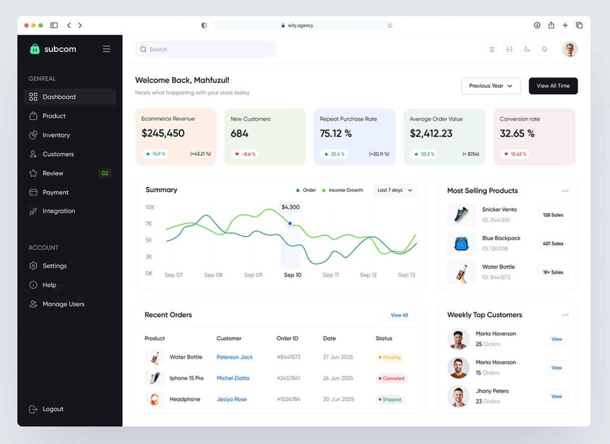  
2. 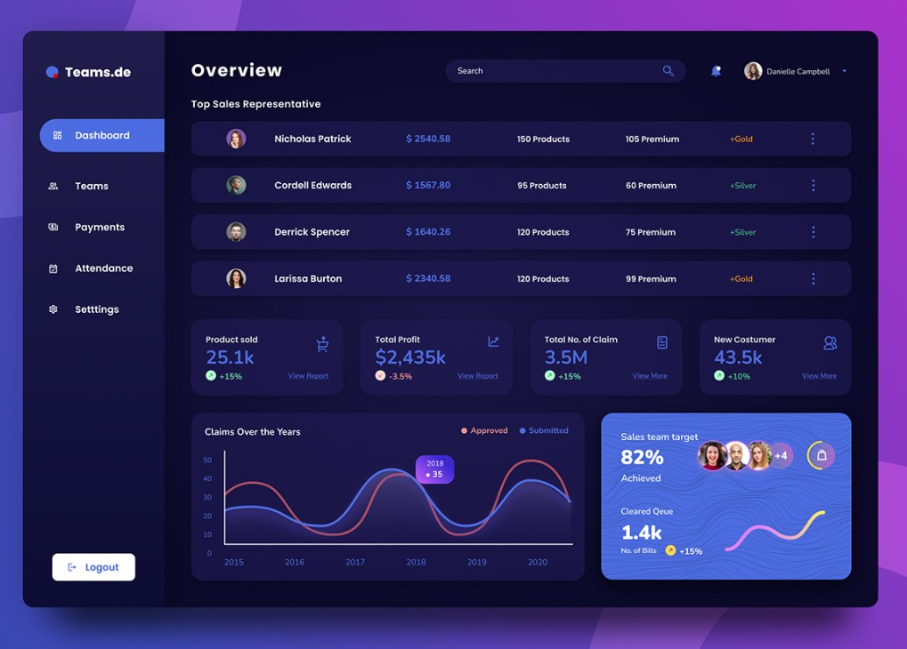  
3. 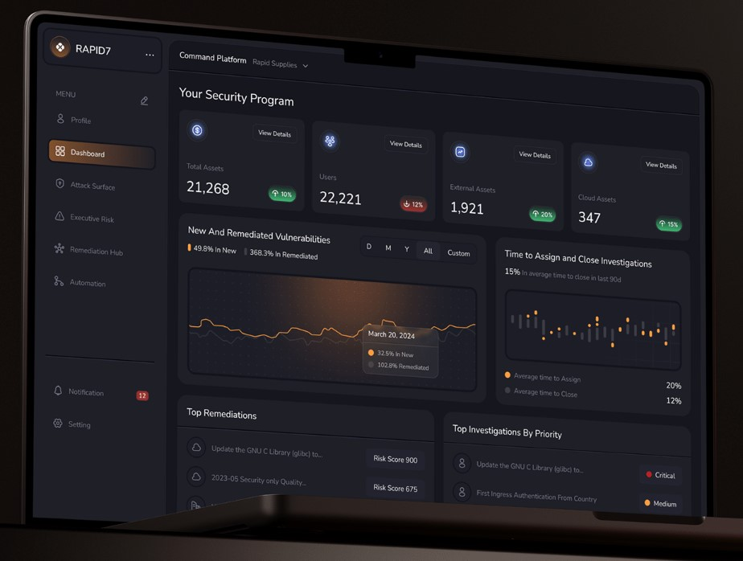  
4. 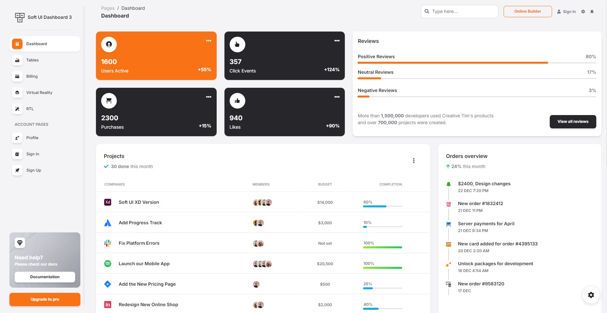  

### Login page

1.   

### Error page

1. 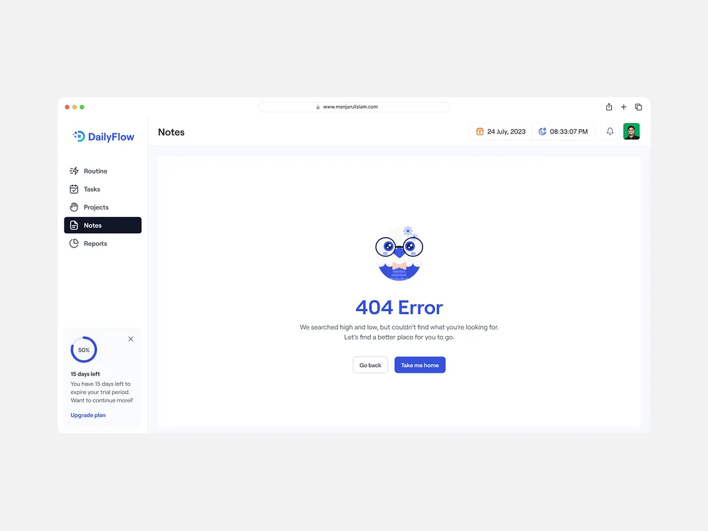  

## Tablet

### Main Pages

1. 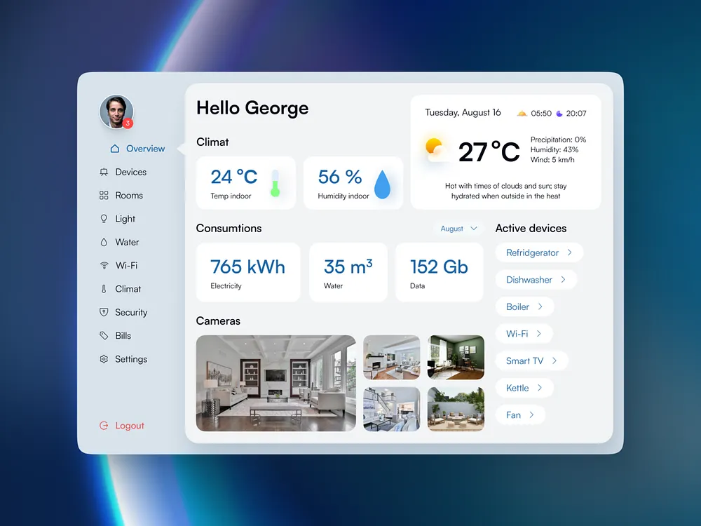  
2. 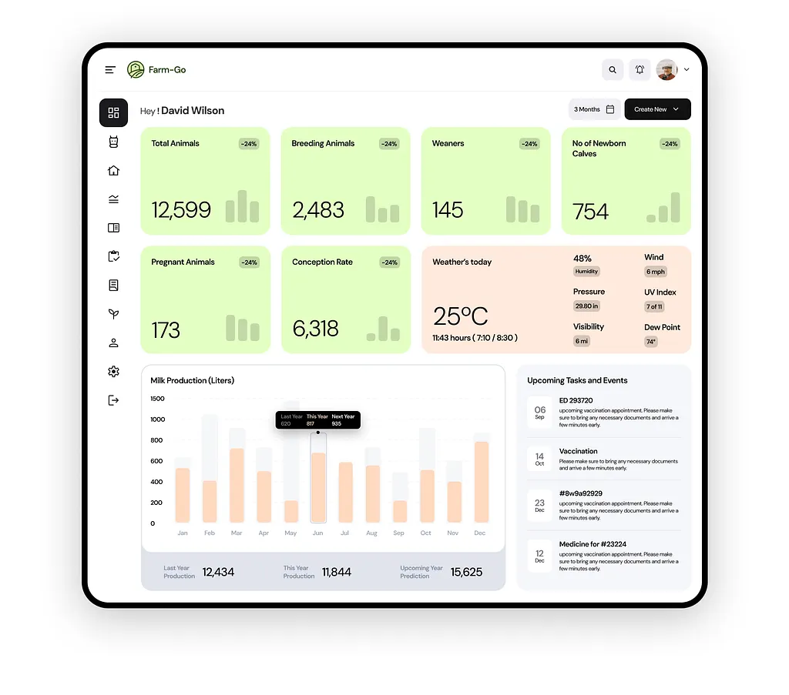  
3. 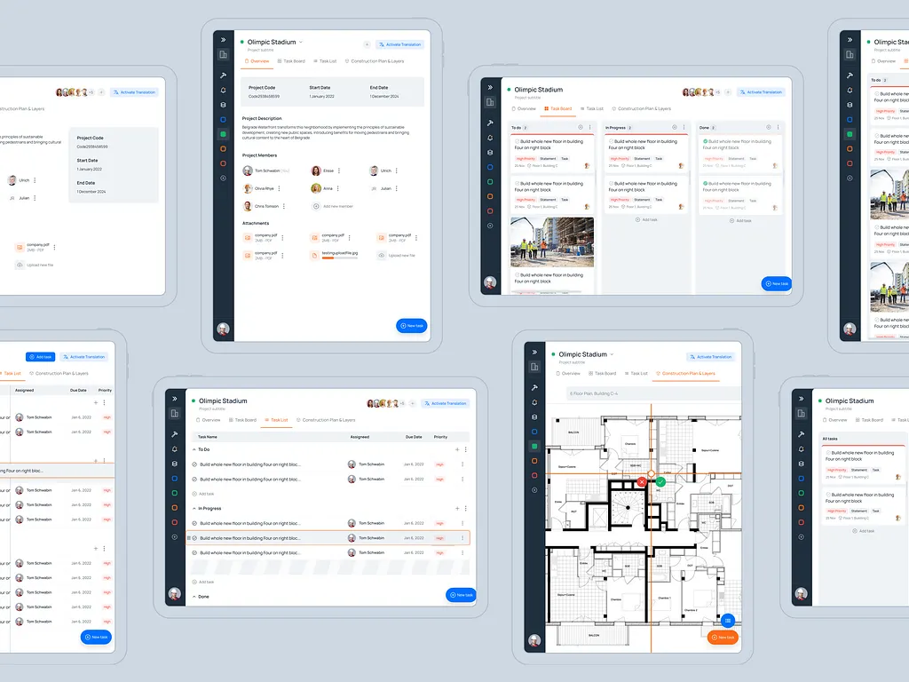  

### Login page

Same as the main page.

### Error page

Same as the main pages, but with a smaller navbar.

## Mobile

### Main Pages

1. 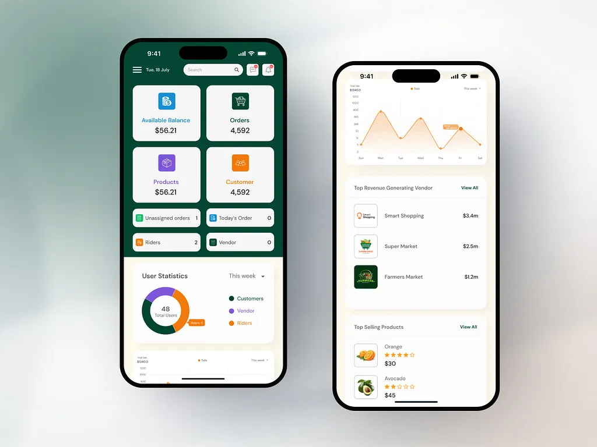
2. 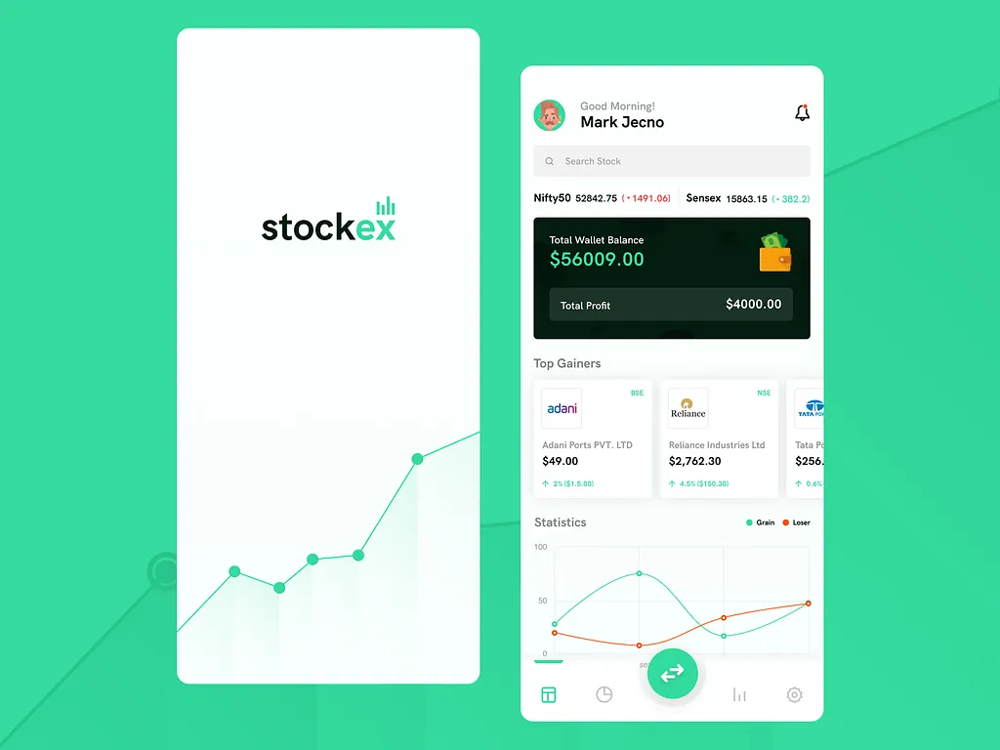
3. 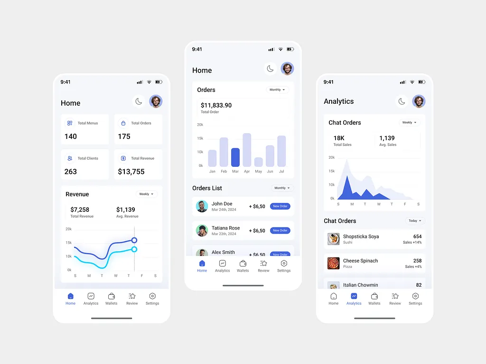

### Login page

1. 

### Error page

Freestyle this one

# Admin-dashboard example <!--TODO: Remove after completion -->

- [An example](https://example.admin.refine.dev)
