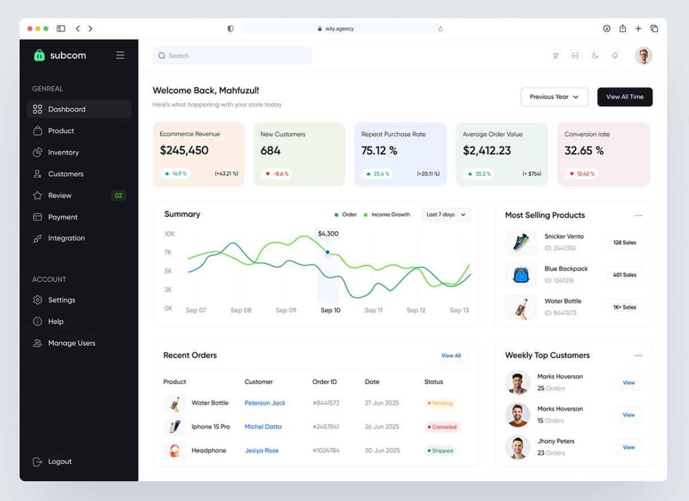
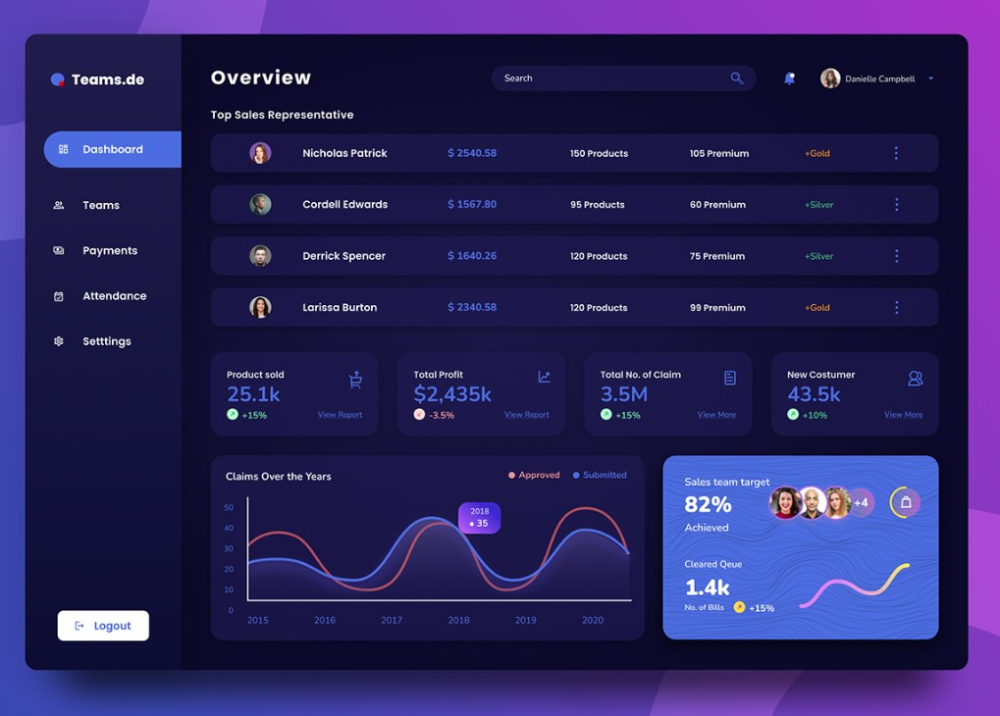
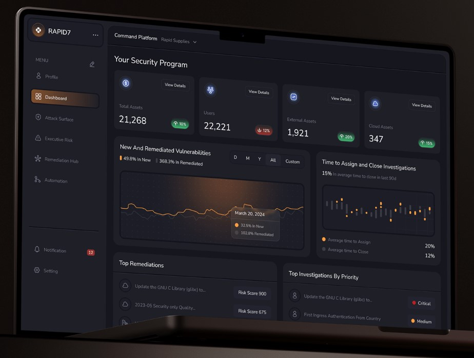
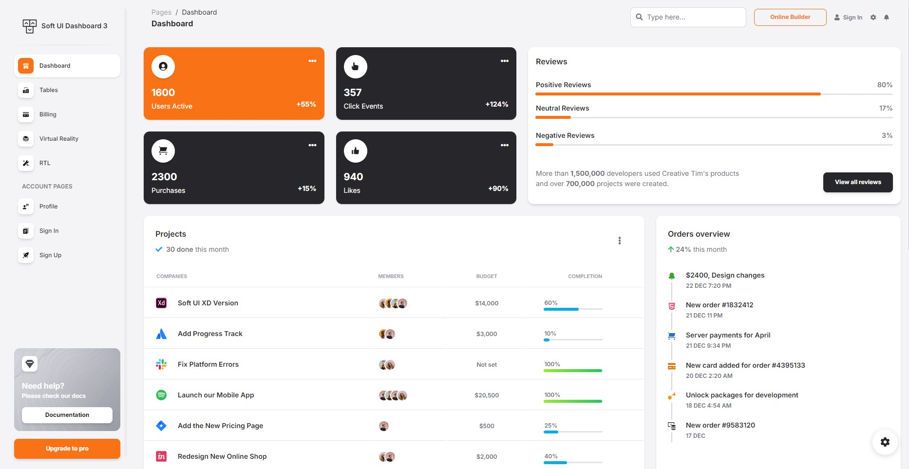

 E-commerce Administrator Dashboard 

A work-in-progress project for my portfolio designed exclusively with frontend technologies using a dummy API and some generated mock data.

# Overview

- [Requests and Features](#Requests-and-features)

  - [Requests](#requests)
  - [Features](#features)
  - [Other functionalities](#Other-functionalities)

- [Pages](#pages)

  - [Dashboard](#dashboard-homepage)
  - [Goods](#goods-page)
  - [Services](#services-page)
  - [Analytics](#analytics-page)
  - [Customers](#sales-channels-page)
  - [Sales Channels]()
  - [Login](#login-page)
  - [Error](#error-page)

- [Technologies](#technologies)
  - [Logic](#logic)
  - [Styling](#styling)
  - [Animation](#animations)
  - [Other](#other)
- [Design](#design)

# Requests and features

## Requests:

- **Today's** sales, also a _comparison_ between today's sales and the sales on the same day last year, and the year before
- **This week's** sales, with the same _comparison_
- **This month's** sales, with the same _comparison_
- **This year's** sales, with _comparison_ from the beginning of the year until the same day of the year - for the past 2 years

**Structure of the sales**:

1.  Total _goods_, with a list of goods, sorted in decending order
2.  Total _services_, with a list of services, sorted in decending order
3.  Total _profits_ from goods, profit margin - with analytics: for this week, this month and this year - compared to the past 2 years
4.  _Analytics of the sales by salespeople_: total sales, total profits and profit margins
5.  _Structure of the sales by sales channels_: webshop, invoices, customer visits

## Features:

The ability to view:

1. Total goods, with a list of goods, sorted in decending order
2. Total services, with a list of services, sorted in decending order
3. Total profits from goods, profit margin - with analytics: for this week, this month and this year - compared to the past 2 years

## Other functionalities

- If the admin IS NOT logged in - don't allow access to the application
- Toggle switch between light and dark mode
  - Alternatively/Additionaly, themes?
- Optional: Language switch

# Pages:

## Login page

Upon opening the app this is the first page the user is taken to. There is a username and password input fields which the user must fill. If correct, the dasboard becomes available, if not, a message appears under the input fields signalling that something went wrong.

## Dashboard (HomePage)

**Time filter** - The dashboard homepage includes a **select field** in which we can pick an option: "weekly", "monthly", "yearly", "last 2 years", "All time" upon which the Dashboard homepage will display the data with that filter.
Filter explanation:

- Weekly means the past 7 days starting from yesterday.
- Monthly means the past 30 days starting from yesterday.
- Yearly means the past 365 days starting from yesterday.
- Last 2 years means the past 2 years starting from yesterday.
- All time means from the creation of the first order by a customer to yesterday.

Based on that filter:

- The **cards** will display data for the _current_ week/month/year/last 2 years/all time and _comparrison_ (percentage indicator) for the same time filter but for the date 1 increment before that (eg. If the filter is on "week" (last 7 days), the comparison will be for the 7 days before that).
- The **charts** will display the data for the _current_ week/month/year/last 2 years (there is no comparrison to previous time filters like with the cards).
- The **lists** will also display the data from the _current_ week/month/year/last 2 years.

The data will be displayed with these components:

1. **Sales revenue card** - displays total revenue.
2. **Sales profit card** - displays sales profit (revenue - expenses).
3. **New customers card** - displays the number of new customers (based on data from the past week, month, year, 2 years, all time according to the filter). <!--Hashmap?-->
4. **Average order value card** - displays the average price of the total orders of all customers based on the specified filter.
5. **Repeat purchase rate card** - <!--TODO: think of what to make this component -->
6. **Trending goods list**

- Displays the _goods_ that, based on the time filter, are being sold the most.
<!--TODO: Think of a better name "secured in the highest volume" is too long for a filter-->
- Upon clicking this list, it takes us to the [Goods page](#Goods-page) and sets the filter on that page to "secured in the highest volume".
- Alternatively, clicking on a good takes us to the dynamically generated page for that particullar good [Dynamic good page](#Dynamic-good-page).
- Alternatively, this could also be a **Bar Chart**, or there could be a toggle option from chart-to-list/list-to-chart

7. **Trending services list**

- Displays the _services_ that, based on the filter, are bing sold the most.
<!--TODO: Think of a better name "secured in the highest volume" is too long for a filter-->
- Upon clicking this list it takes us to the [Services page](#Services-page) and sets the filter on that page to "secured in the highest volume".
- Alternatively, clicking on a service takes us to the dynamically generated page for that particullar good [Dynamic services page](#Dynamic-service-page).
- Alternatively, this could also be a **Bar Chart**, or there could be a toggle option from chart-to-list/list-to-chart

8. **Recent orders list** - displays the most recent orders. This card does NOT care about the filter and just displays the last few goods/services that were purchased.

9. **Top customers list** - displays the customers that generated the most revenue weekly/monthly/yearly/from the last 2 years/all time based on the filter.

10. <!--TODO: Define a few charts and what they should be about-->

Must implement features:

- All of the cards must include a small **percentage increase/decrease indicator** on the bottom right/left to compare the results from the previous week, month, year or the last 2 years (based on the selector).

- The elements in the Dashboard must be **draggable** so that the Admin can customize their app accordingly.

- Best chart practices:
  - Line charts for trends over time
  - Bar charts for comparisons
  - Pie charts for distribution

 

## Goods page

Just as the [Dashboard homepage](#dashboard-homepage) this page will also include the time filter.

Elements:

1. A **list** of all _goods_, sorted by filter (A-Z, Z-A, low-to-high price, high-to-low price, date ascending, date decending, secured the highest volume, secured the lowest volume)

- Upon clicking one of the list items - go to a [dynamically generated good page](#Dynamic-good-page) for that particular _good_ just the same as in the Trending goods list in [Dashboard homepage](#dashboard-homepage)
- add pagination

Include these elements based on the time filter:

2. A **Line chart** that displays the _revenue_ generated by each of the goods.
3. A **Line chart** that displays the _profit_ generated by each of the goods.
4. A **Line chart** that displays how much each good _costs_ to produce/buy from the manufacturer.

These next elements are ought to include a small _percentage indicator %_ that compares the data to itself based on the time filter (eg. If "past 7 days" is selected, the percentage indicator shows the comparred data between the past 7 days and the 7 days before them starting from yesterday):

5. A **Revenue card** that displays the _total revenue_ generated numerically.
6. A **Profit card** that displays the _total profit_ generated numerically.
7. A **Costs card** that display the _total cost_ generated numerically.

Another functionality - A comparrison sub-page that implements the time filter. There are two selections for 2 different goods split down the middle of the window. Upon selecting an option in the time filter and selecting the desired goods, a comparison will be displayed made by :

- Generated revenue
- Generated profit
- Accumulated Costs
- Other relative comparrisons

 

## Services page

Just as the [Dashboard homepage](#dashboard-homepage) this page will also include the time filter.

1. A **list** of all _services_, sorted by filter (A-Z, Z-A, low-to-high price, high-to-low price, date ascending, date decending, secured the highest volume, secured the lowest volume)

- Upon clicking one of the list items - go to a [dynamically generated good page](#Dynamic-services-page) for that particular _service_ just the same as in the Trending services list in [Dashboard homepage](#dashboard-homepage)
- add pagination

The services page is to include these elements based on the time filter:

2. A **Line chart** that displays the revenue generated by each of the services.
3. A **Line chart** that displays the demand of the services.
4. A **Line chart** that displays how much each service costs to implement (how much the employees are paid to produce that service).

These next elements are ought to include a small _percentage indicator %_ that compares the data to itself based on the time filter (eg. If "past 7 days" is selected, the percentage indicator shows the comparred data between the past 7 days and the 7 days before them starting from yesterday):

5. A **Revenue card** that displays the _total revenue_ generated numerically.
6. A **Profit card** that displays the _total profit_ generated numerically.
7. A **Costs card** that display the _total cost_ generated numerically.

Another functionality - A comparrison sub-page that implements the time filter. There are two selections for 2 different services split down the middle of the window. Upon selecting an option in the time filter and selecting the desired goods, a comparison will be displayed made by :

- Generated revenue
- Generated profit
- Accumulated Costs
- Other relative comparrisons

## Analytics page

The analytics page is to analyze the performance of employees - "the sales of the salespeople". Just as the [Dashboard homepage](#dashboard-homepage) this page will also include the time filter.

Elements:

1. A **list** with all the employees at the company sorted by a filter (A-Z, Z-A, date of employment decending, date of employment ascending, secured the highest volume, secured the lowest volume)

- Upon clicking one of the list items - go to a [dynamically generated good page](#Dynamic-salesperson-page) for that particular _salesperson_ just the same as in the Trending goods list in [Dashboard homepage](#dashboard-homepage)
- add pagination

The analytics page is to include these elements based on the time filter:

2. A **Line chart** that displays the _revenue_ generated by each employee.
3. A **Line chart** that displays the _profit_ generated by each employee.
4. A **Bar chart** that displays the total _number of services done_ by each employee.
5. A **Bar chart** that displats the total _number of goods sold_ by each employee.

These next elements are ought to include a small _percentage indicator %_ that compares the data to itself based on the time filter (eg. If "past 7 days" is selected, the percentage indicator shows the comparred data between the past 7 days and the 7 days before them starting from yesterday):

5. A **Revenue card** that displays the _total revenue_ generated numerically.
6. A **Profit card** that displays the _total profit_ generated numerically.
7. A **Costs card** that display the _total cost_ generated numerically.

Another functionality - A comparrison sub-page that implements the time filter. There are two selections for 2 different salespeople split down the middle of the window. Upon selecting an option in the time filter and selecting the desired salespeople, a comparison will be displayed made by :

- Generated revenue
- Generated profit
- Accumulated Costs
- Other relative comparrisons

 

## Sales channels page

This page includes a **list** of all the sales channels (physical locations) that the business owns. Upon clicking one of these physical locations a (Dynamic sales channel page)[#dynamic-sales-channel-page] is opened in which data for the location is displayed.

 

## Error page

This page will be used for invalid URLs. It must include a link to previous page and/or Homepage

 

# Technologies

### Logic:

- [React](https://react.dev/learn/typescript) framework of choice.
- [React Context API](https://react.dev/reference/react/createContext) for managing global state.
- [React Router](https://reactrouter.com) for managing routes.
- [Typescript](https://www.typescriptlang.org/docs/) language of choice.

### Styling:

- [Material UI](https://mui.com) styled components.

### Animations:

- [React Motion](https://motion.dev) animations and transitions.

### Other

- [DNDkit](https://dndkit.com) drag and drop functionality.

# Design <!--TODO: After completion, replace with screenshots from the current finished design -->

These are some of the current design ideas:

- [Design 1](https://www.behance.net/gallery/184403667/E-commerce-Admin-Dashboard-Design)
  

- [Design 2](https://www.behance.net/gallery/177641865/Admin-Dashboard-Design?tracking_source=search_projects|e-commerce+admin+dashboard+design&l=0)
  

- [Design 3](https://www.behance.net/gallery/212217641/Cybersecurity-Dashboard)
  

- [Design 4](https://demos.creative-tim.com/soft-ui-dashboard/pages/dashboard.html)
  

# Admin-dashboard example <!--TODO: Remove after completion -->

- [An example](https://example.admin.refine.dev)
